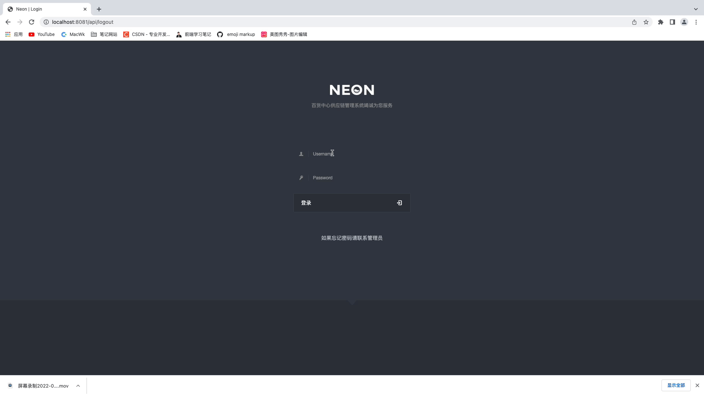
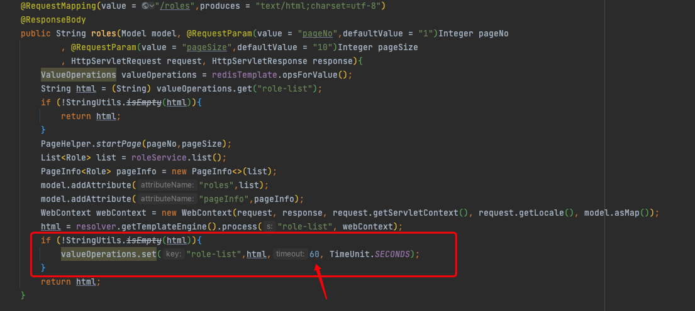
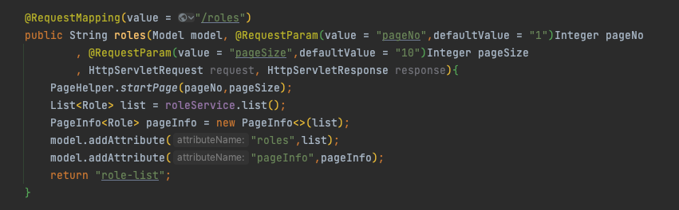

#  :tw-1f31f: supplier  :tw-1f31f: 

###  :tw-1f38a: 介绍
百货中心供应链管理系统 

### 项目最终演示

###  :tw-1f372: 课程设计

###  :tw-1f347: 基本业务
本系统包含一些简单的增删改查以及对用户权限的分配，并未使用权限框架
所涉及的用户对应的权限所能使用的功能由thymeleaf语法进行鉴别

###  :tw-1f352: 技术要求：
-  :tw-1f34a: SpringBoot
-  :tw-1f34b: Mybatis-Plus
-  :tw-1f34c: Thymeleaf
-  :tw-1f34d: Redis（页面优化）
-  :tw-1f349: BootStrap

### 注意 :tw-2757:  :tw-2757: 
如果各位同学用的最新一版的代码出现添加数据不能及时显现出来，是由于我在项目中使用Redis对部分接口进行了优化处理 
当你第一次访问某一个列表的时候，会将此时的数据缓存在Redis中，时效1分钟（目的是防止某一时刻接口流量骤增） 
当然本系统也不会出现流量突然骤增的情况 :tw-1f436:  
只是为了将学过的知识达到学以致用的效果！请各位见谅！如果不喜欢可以使用以下两种方法进行解决： 
1. 将Redis的过期时间设置为 **1s** 即可！（但是这样使用Redis就没什么效果了）
2. 修改接口为原始状态：见下图：

如果不做修改只需修改过期时间即可！

如果想要修改接口的话上图的接口进行还原！见下图：

###  :tw-1f364: sql文件
SQL文件存在于resources目录下 
在首先在数据库中添加一个用户，密码是需要加密的 
请在utils目录下的密码工具类中生成相应的salt值和密码
 **用户密码都是：123456** 

###  :tw-1f38b: 部分脚本语言注释 :tw-1f38b: 

如果各位感觉派大星服务的还不错的话，还望各位动动小手为项目点点 **Star**  :tw-1f31f:  
关注派大星，后续还会开源优质的项目源码！ 
如果出现问题，请在下方留言！看到会及时做出回应，帮助各位解答疑惑！ :tw-1f60a: 
